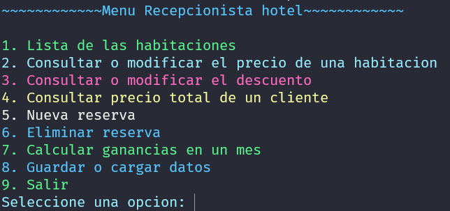

# POO_Hotel

Este es un proyecto de la asignatura de Programación Orientada a Objetos del año académico 2023-24. El proyecto consiste en la implementación de un sistema de gestión para un hotel utilizando el lenguaje de programación C++.

## Estructura del Proyecto

La estructura principal del proyecto es la siguiente:

- `.gitattributes`
- `.gitignore`
- `Hotel.sln`
- `Hotel` (directorio principal del proyecto)

## Descripción del Proyecto

El sistema de gestión del hotel permite realizar diversas operaciones como la reserva de habitaciones, la gestión de clientes y la administración de servicios del hotel.

